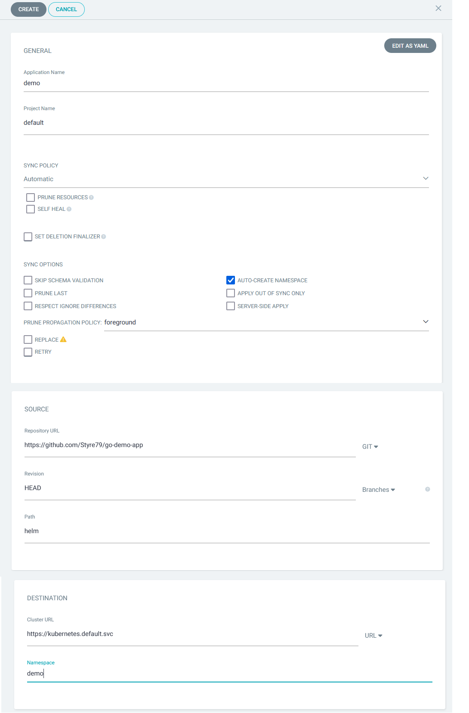
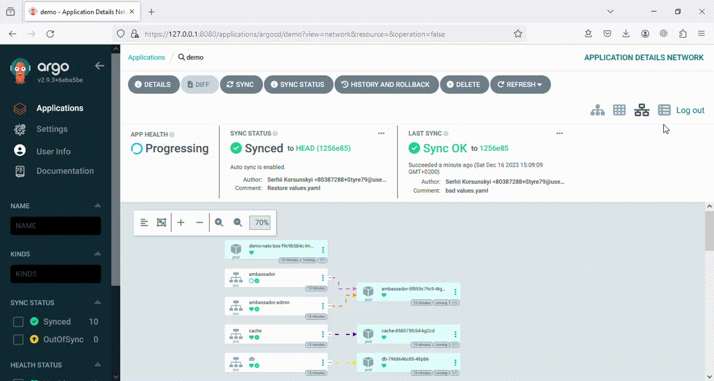

# Minimum Viable Product

## **Демо-інструкція створення додатку за допомогою графічного інтерфейсу ArgoCD.**
Додаток буде відслідковувати Git репозиторій продукту https://github.com/Styre79/go-demo-app та автоматично синхронізуватися.

1. Створюємо додаток за допомогою графічного інтерфейсу. 
	- Натискаємо **+ NEW APP**
	- Розділ **GENERAL**: 
		+ вводимо ім'я додатку **demo**
		+ обираємо проект до якого належить додаток **default** (за замовчуванням)
		+ Тип синхронізації обираємо **Automatic**
	- Розділ **SOURCE**: 
		+ вводемо url репозиторію, який містить маніфести для розгортання **https://github.com/Styre79/go-demo-app** (поле **Repository URL**). Тип джерела **GIT**
		+ вводемо **helm** шлях до каталогу helm, де безпосередньо знаходяться маніфести для розгортання (поле **Path**)
	- Розділ **DESTINATION**: 
		+ вказуємо **https://kubernetes.default.svc** url локального кластеру (поле **Cluster URL**)
		+ вводимо им'я простору імен (неймспейсу) **demo**  (поле **Namespace**) для автоматичного визначення системою ArgoCD параметрів додатку за допомогою маніфестів, які знаходяться в репозиторії. Для зміни значеннь вручну можна скористатись розділом **PARAMETERS**.
	- Розділ **SYNC POLICY**:
		+  ставимо пташку навпроти **AUTO-CREATE NAMESPACE**, щоб ArgoCD створив новий namespace, тому що в helm наразі ця функція за замовчуванням відсутня. 
	- Натискаємо **CREATE** (створити додаток)



### Демонстрація створення додатку у ArgoCD:


Переглянути деталі розгорнутого застосунку можна натиснувши на нього в списку.


2. Синхронізація застосунку:
       - внесемо зміни в файлі *helm/values.yaml* (повернемо типу api-gateway значення NodePort) в репозиторії https://github.com/Styre79/go-demo-app. Подивимось на виконання синхронізації:

### Демонстрація синхронізації застосунку:



3. Переконаємося в працездатності застосунку:
	- для отримання доступу до застосунку прокинемо локальний порт 33333 на віддалений 80
 ```bash
$ kubectl port-forward -n demo svc/ambassador 33333:80
```
в іншому терміналі
	- завантажимо довільну картинку:
```bash
$ wget -O /tmp/g.png https://pngimg.com/uploads/google/google_PNG19640.png
```
   - передамо завантажене зображення у застосунок та отримаємо результат у терміналі у вигляді ascii art:
```bash
curl -F 'image=@/tmp/g.png' localhost:33333/img/
```

### Демонстрація роботи застосунку:

