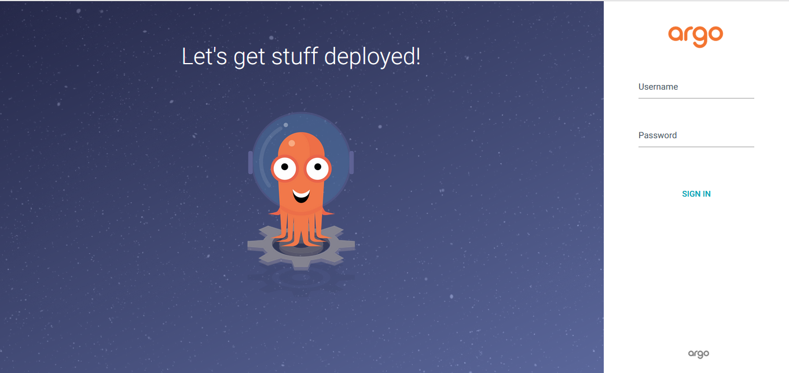
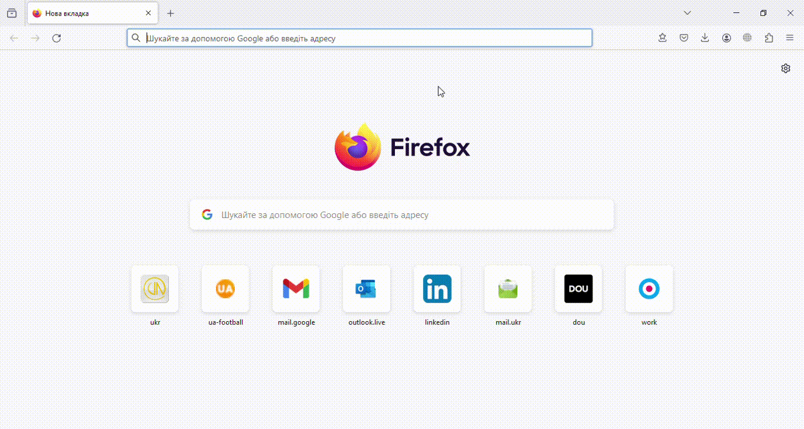

# Proof of Concept

## **Демо-інструкція з встановлення у локальний кластер та налаштування доступу до графічного інтерфейсу ArgoCD.**

1. Створюємо локальний кластер та впевнюємось, що він запустився і працює: 

```bash
$ k3d cluster create argo

$ kubectl cluster-info
```

2. Створюємо namespace (перевіряємо його статус), в який за допомогою скрипта встановлюємо систему ArgoCD, перевіряємо стан системи після встановлення:

```bash
$ kubectl create namespace argocd

$ kubectl get ns

$ kubectl apply -n argocd -f https://raw.githubusercontent.com/argoproj/argo-cd/stable/manifests/install.yaml

$ kubectl get all -n argocd
```

3. Отримуємо доступ до графічного інтерфейсу(GUІ) ArgoCD:
В данному випадку скористаємось Port Forwarding (прокиданням локального порта 8080 на віддалений 443). ArgoCD за замовчуванням працює з https, тому у браузері встановлюємо сертифікати (для локльного використання достатньо самопідписаного)

```bash
$ kubectl port-forward svc/argocd-server -n argocd 8080:443&
```

4. Отримаємо початковий пароль для облікового запису адміністратора, який генерується автоматично та зберігається як секрет:
```bash                                                                                    
$ kubectl -n argocd get secret argocd-initial-admin-secret -o jsonpath="{.data.password}"|base64 -d;echo
```

Якщо все зроблено правильно, то перейшовши за адресою https://127.0.0.1:8080/ побачимо:



де у поле Login вводимо admin, а у Password копіюємо пароль отриманий у п.4 цієї інструкції.


### Демонстрація встановлення та налаштування ArgoCD:


### Демонстрація доступу до ArgoCD через Web-інтерфейс:


